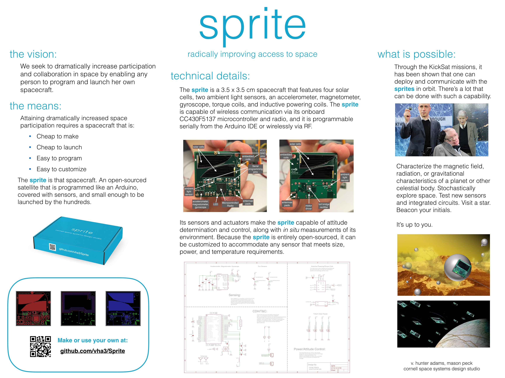

 You've reached the repository for the Sprite chipsat. The folders above include everything that you need to start using a newly purchased Sprite or to make one of your own.

 All necessary prototyping materials for programming the Sprite are included in the Sprite development kit. For those that bought or made a Sprite independently, a DigiKey cart is provided below that includes all necessary materials.

http://www.digikey.com/short/3zwh0t

##Just Bought a Sprite?
See the Sprite User's Manual in the main repo above. This document will walk you through software installation and wiring your Sprite for programming. The Demo Software folder contains a number of Arduino sketches that exercise the Sprite's various sensors and actuators. The ReadMe within the Demo Software folder links to the panStamp example sketches folder, which contains a number more example sketches that will work on the Sprite.

##Making Your Own Sprite?
The above folders contain all of the necessary files and information for having your own Sprite made by a board house. Download this repo, and send a zipped file containing the Gerbers, BOM and CPL, and the images to any board house (request a half-width board, if you intend for it to be used with the Sprite mothership deployer). You may also be interested in downloading the Eagle Cad board and schematic files to customize your own board. Both of these can be found in the Eagle folder.

